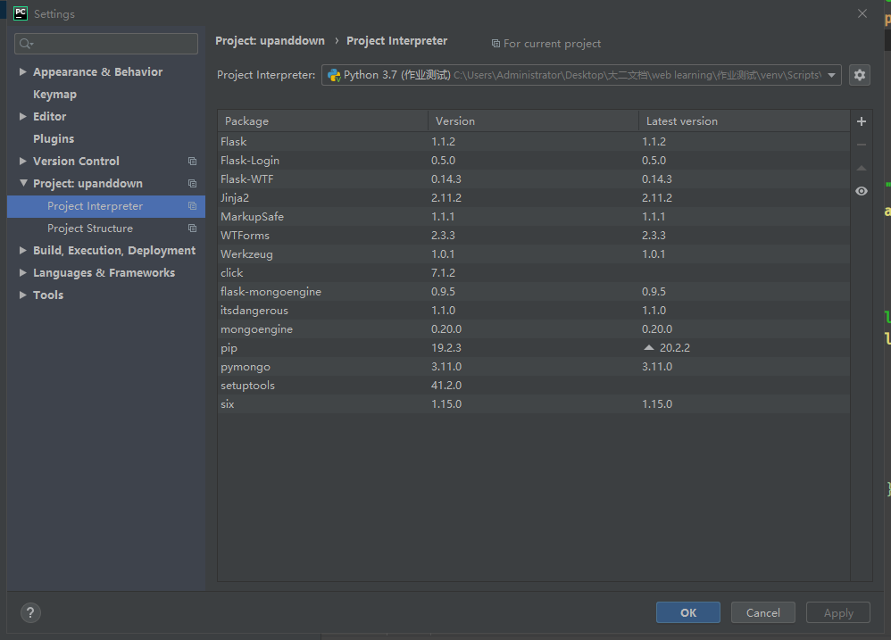

# 同济软院2020web作业--简单购物网站设计文档

> 作者：徐炳昌
>
> 学号：1850953

[TOC]

## 1.功能
1. 用户登录注册
2. 展示商品
3. 登录状态下添加购物车
4. 登录状态下结算下单
5. 登录状态下查询历史订单
## 2.技术栈

### 2.1 前端

1. 原生html+css

### 2.2 后端

1. flask
2. MongoDB

## 3.使用插件

```
flask
flask_login
flask_mongoengine
```

## 4.使用方法

> 可以通过文件中的视频来观看效果，本地复现本项目较为复杂，如非必须不建议尝试，如若必须请尝试按照一下的指引完成复现，出现问题可以联系790543965@qq.com

1. 首先安装python环境

2. 按照flask官网搭建虚拟Python环境

3. 按照MongoDB官网的教程安装MongoDB本地版（注意不要使用云端版本）

4. 以上述的虚拟Python环境，通过PyCharm运行文件夹中的app.py文件

5. PyCharm环境示意如图

   

